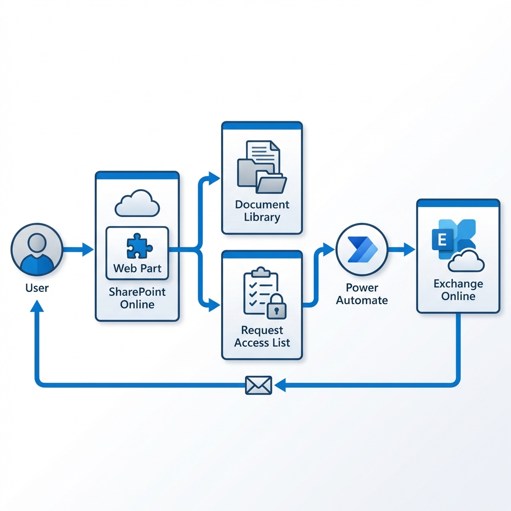
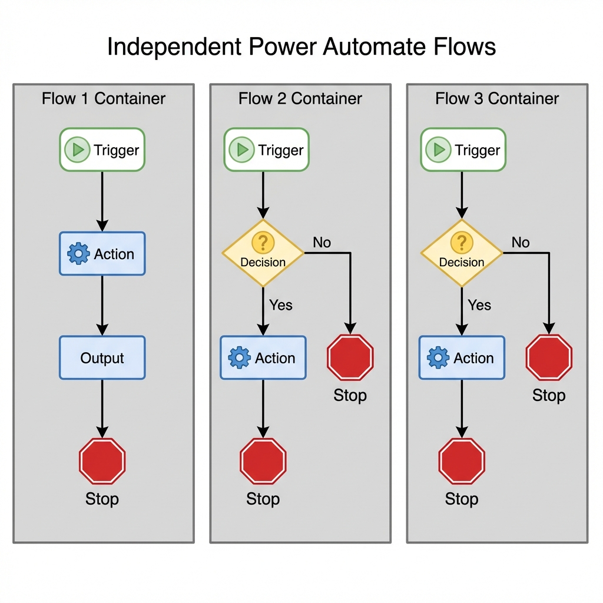
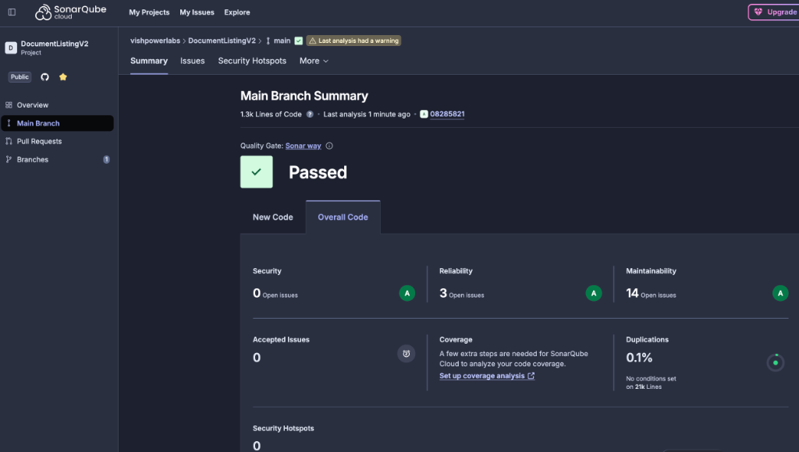

# Document Listing V2 - Architecture & Design

This document outlines the comprehensive architecture, design specifications, and implementation details of the Document Listing V2 solution. It covers User Experience (UX), Data Structures, Communication, Automation, and Deployment.

## 1. Project Overview & Use Cases

The **Document Listing V2** is a persistent, theme-aware SharePoint Framework (SPFx) web part designed to display a searchable and filterable catalog of documents from a specified source library. It provides distinct features for categorizing content, requesting access to specific documents, and managing those requests via a separate SharePoint list.

### Why use it?
-   **Curated Experience**: Present policies, procedures, and templates in a polished, user-friendly grid.
-   **Access Control**: Allow users to *see* documents exist but require approval/tracking to *download* or *access* them (e.g., Sensitive forms).
-   **Theme Consistency**: Seamlessly blends with any SharePoint site theme.

## 2. Architecture Diagram




## 3. Technical Stack

-   **Framework**: SharePoint Framework (SPFx)
-   **Frontend**: React (Functional Components + Hooks)
-   **UI Library**: Fluent UI (Office UI Fabric)
-   **Data Access**: SPHttpClient (REST API)
-   **Styling**: SCSS Modules with Theme Token support
-   **Automation**: Power Automate (Flow)
-   **Messaging**: Exchange Online

## 4. UX Layer (SPO > SPFx)

The User Experience is delivered via SharePoint Online (SPO) using the SharePoint Framework (SPFx).

### Key Features
-   **Dynamic Catalog**: Fetches documents from a SharePoint Document Library.
-   **Multi-Level Filtering**: Side Navigation (Category), Top Tabs (SubCategory), and Search Bar.
-   **Access Request Workflow**: Users can request documents; requests are logged in a separate list to prevent duplicates and enable approval flows.
-   **Premium UI/UX**: Theme-aware contrast, transparent icons, and responsive layout.

### Visual Requirements
-   **Components**: Fluent UI details list, command bar, and panel interactions.
-   **Branding**: Header opacity and text color automatically adapt to site theme.
-   **Icons**: Standard Fluent file type icons with transparent backgrounds.

## 5. Data Layer & Schema

Data is structured across SharePoint Lists and Libraries to separate content from operational data.

### A. User Guides (Source Document Library)
Role: **Content Storage**.
Permissions: **Read-Only** for general users.

| Internal Name | Type | Purpose |
| :--- | :--- | :--- |
| `FileLeafRef` | Text | Filename |
| `Title` | Text | Display Title |
| `Category` | Choice | Primary grouping (Side Nav) |
| `SubCategory` | Choice | Secondary grouping (Top Tabs) |
| `Description` | Note | Details shown in grid |
| `IsPinned` | Yes/No | Top-of-list pinning logic |

### B. Feedback Tracking (Request Access List)
Role: **Transactional Logging**.
Permissions: **Contribute** (Users create items).

| Internal Name | Type | Purpose |
| :--- | :--- | :--- |
| `Title` | Text | "Request for [Doc Name]" |
| `Email` | Text | Requester's email |
| `FileID` | Text | ID of requested document |
| `RequestID` | Text | Unique GUID |
| `RequestDate` | DateTime | Timestamp of request |
| `DownloadDate` | DateTime | When file was accessed |
| `FeedbackProvided` | Yes/No | Has feedback been given? |
| `FeedbackRequired` | Yes/No | System flag for automation |

## 6. Automation Layer (Power Automate)



Business logic is decoupled from the web part and handled by Power Automate flows.

### Flow 1: Send Download Link
-   **Trigger**: Item Created in "Request Access List".
-   **Action**: Generates a sharing link or retrieves the direct link.
-   **Output**: Sends an email to the user with the "Download Document" button.

### Flow 2: Send Feedback Link
-   **Trigger**: Scheduled (e.g., 14 days after Download).
-   **Logic**: IF `Feedback Provided` is `No` -> Send Request.

### Flow 3: Send Feedback Reminder
-   **Trigger**: Scheduled (Follow-up to Flow 2).
-   **Logic**: IF `Feedback Required` is `Yes` AND Time > Threshold -> Send Nudge.

## 7. Prerequisites & Security Model

Successful deployment requires strict adherence to the following configuration models.

### Web Part Configuration

The web part is configured via three primary groups in the Property Pane.

#### 1. Display Settings
Controls the visual header and text styling.

| Property | Type | Description |
| :--- | :--- | :--- |
| **Web Part Title** | Text | Header title (e.g., "Company Policies"). |
| **Title Font Size** | Dropdown | Size of the title text (16px - 32px). |
| **Web Part Description** | Multiline | Subtitle or instructions for users. |
| **Description Font Size** | Dropdown | Size of the description text (12px - 18px). |
| **Header Opacity** | Slider | Transparency of the header background (0.0 - 1.0). |

#### 2. Document Library Settings
Configures the source of the documents.

| Property | Type | Description |
| :--- | :--- | :--- |
| **Select Site** | Site Picker | The SharePoint site hosting the documents. |
| **Source Document Library** | Dropdown | The specific library to display. |
| **Category Field** | Dropdown | Column for Side Navigation grouping. |
| **Sub-Category Field** | Dropdown | Column for Top Tabs grouping. |
| **Description Field** | Dropdown | Column for document details/summary. |
| **Items per page** | Text | Number of items to show per page (Pagination). |
| **Pinned Column** | Dropdown | Column determining pinned status (Yes/No). |

#### 3. Request Access Settings
Configures the feedback and access tracking workflow.

| Property | Type | Description |
| :--- | :--- | :--- |
| **Show Request Access Column** | Toggle | On/Off switch for the entire request feature. |
| **Select Request Site** | Site Picker | The site hosting the tracking list. |
| **Requests List** | Dropdown | The list where requests are logged. |
| **Email Field** | Dropdown | Field to store requester's email. |
| **File ID Field** | Dropdown | Field to store the requested Document ID. |
| **Request ID Field** | Dropdown | Field to store the unique GUID. |
| **Request Date Field** | Dropdown | Field to store the timestamp. |
| **Reminder Field** | Dropdown | Field to track if a reminder was sent. |
| **Already Requested Message** | Multiline | Toast message for duplicate requests. |
| **Reminder Sent Message** | Text | Toast message for successful nudges. |

### Permission Requirements
#### Source Document Library
-   **Access**: **Read-Only** for visitors.
-   **Rationale**: Prevents modification of official documents.

#### Request Access List
-   **Access**: **Contribute**.
-   **Item-Level Security**:
    -   *Read access*: "Read items that were created by the user"
    -   *Edit access*: "Create items and edit items that were created by the user"
    -   **Rationale**: Privacy and integrity; users cannot see or modify others' requests.

## 8. Build & Deployment

### Build Commands
```bash
# Install dependencies
npm install

# Bundle for production
gulp bundle --ship

# Package solution (.sppkg)
gulp package-solution --ship
```

### Deployment
1.  Upload `.sppkg` to **App Catalog**.
2.  Deploy and trust the solution.
3.  Add web part to page.

## 9. Future Roadmap
-   **Feedback Collection**: integrated rating dialog in the web part.
-   **Usage Analytics**: Dashboard for most requested documents.
-   **Auto-Approval**: Immediate access for low-risk categories.

## 10. Code Quality & Security (SonarQube)

The solution is continuously monitored for code quality and security vulnerabilities using **SonarCloud/SonarQube**.

### Latest Scan Results


-   **Quality Gate**: ✅ **Passed**
-   **Security**: **A** Rating (0 Open Issues)
-   **Reliability**: **A** Rating (3 Low-priority issues)
-   **Maintainability**: **A** Rating (14 Code Smells - Minor)
-   **Duplications**: **0.1%** (Excellent)

This ensures the codebase remains secure, maintainable, and free of critical bugs before deployment.
