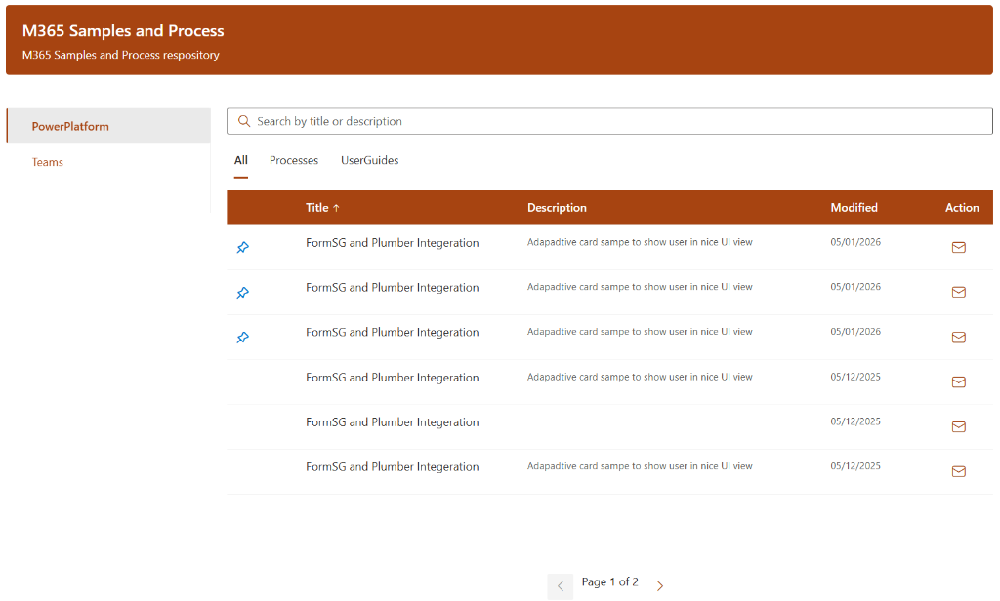

# Custom Document Listing
## Architecture & Design Overview

---

# Agenda

1. Project Overview & Use Cases
2. High-Level Architecture
3. Technical Stack
4. UX Layer (SharePoint Framework)
5. Data Layer (SharePoint Lists)
6. Automation Layer (Power Automate)
7. Security Model
8. Build & Deployment
9. Code Quality
10. Future Roadmap

---

# Problem Statement: The Challenge

Organizing and managing access to critical documents in SharePoint often leads to frustration:

1. **Discovery Issues**: Users struggle to find the right policy or SOP trapped in deep folder structures.
2. **Access Blind Spots**: No visibility into *who* is accessing sensitive documents or *when*.
3. **Manual Overhead**: Content owners are flooded with email requests for access approvals.
4. **Inconsistent Brand**: Standard libraries look generic and don't match the corporate identity.

---

# The Solution: Order from Chaos

**Custom Document Listing** bridges the gap between chaos and efficiency.


- **Centralized Catalog**: Organized by Category and Sub-Category for instant discovery.
- **Automated Workflow**: Zero-touch access request handling.
- **Audit Trail**: Full tracking of who requested, when, and feedback status.

---

# 1. Project Overview

**Custom Document Listing** is a persistent, theme-aware SPFx web part for displaying curated document catalogs.



### Key Use Cases
1. **Central Policy Hub**: Visualize SOPs & Policies (Categorized).
2. **Controlled Distribution**: Track "Request Access" for sensitive docs.
3. **Feedback Loop**: Automated follow-up & feedback collection.
4. **Self-Service Templates**: Easy discovery for project assets.

---

# 2. Architecture Diagram


---

# 3. Technical Stack

- **Framework**: SharePoint Framework (SPFx) 1.18+
- **Frontend**: React (Functional Components) + Hooks
- **UI System**: Fluent UI (Office UI Fabric)
- **Data Access**: SPHttpClient (REST API)
- **Automation**: Power Automate (Flows)
- **Messaging**: Exchange Online

---

# 4. UX Layer (SPFx)

### Dynamic Catalog
- Fetches real-time data from SharePoint Libraries.
- **Filtering**: Side Nav (Category), Top Tabs (SubCategory), Search Bar.

### Access Request Workflow
- Dedicated "Action" column for restricted files.
- Visual feedback on request status.

### Premium UI/UX
- **Theme Aware**: Dynamic contrast calculation.
- **Responsive**: Mobile-friendly layout.

---

# 5. Data Layer

### A. Source Document Library
- **Role**: Content Storage (PDFs, Docs).
- **Permissions**: **Read-Only** for all users.
- **Key Metadata**: Category, SubCategory, Description, IsPinned.

### B. Request Access List
- **Role**: Transactional Logging.
- **Permissions**: **Contribute** (Create/Edit Own).
- **Key Metadata**: RequestID, Requester Email, FileID, Feedback Status.

---

# 6. Automation Layer


---

# 6. Automation Layer (Details)

1. **Send Download Link**
   - Trigger: Item Created.
   - Action: Generates secure link.
   - Output: Emails user the download button.

2. **Send Feedback Link**
   - Trigger: Scheduled (e.g., +14 days).
   - Logic: If no feedback provided, ask for it.

3. **Send Feedback Reminder**
   - Trigger: Scheduled check.
   - Logic: Nudge user if feedback is overdue.

---

# 7. Security Model

### Web Part Configuration
- **Site Selection**: Cross-site capability (Source Site vs. Request Site).
- **Mapping**: Dynamic field mapping in Property Pane.

### Permissions
| Component        | Access Level | Rationale                                                 |
| :--------------- | :----------- | :-------------------------------------------------------- |
| **Doc Library**  | Read-Only    | Protects "Gold Copy" integrity.                           |
| **Request List** | Contribute*  | *Item-level security:* Users only see their own requests. |

---

# 8. Build & Deployment

### Build Commands
```bash
# Install dependencies
npm install

# Build & Package (Production)
npm run build
```

### Deployment
1. Upload `.sppkg` to **App Catalog**.
2. Deploy and trust the solution.
3. Add web part to page.

---

# 9. Code Quality & Security

**SonarQube Analysis Result: PASSED**


- **Security**: **A** (0 Issues)
- **Reliability**: **A**
- **Maintainability**: **A**

---

# 10. Future Roadmap

- **Feedback Collection**: In-app rating dialog (5-star + comments).
- **Usage Analytics**: Dashboard for "Top Requested Documents".
- **Auto-Approval**: Immediate access for "Public" category documents.

---

# Thank You

**Questions?**
